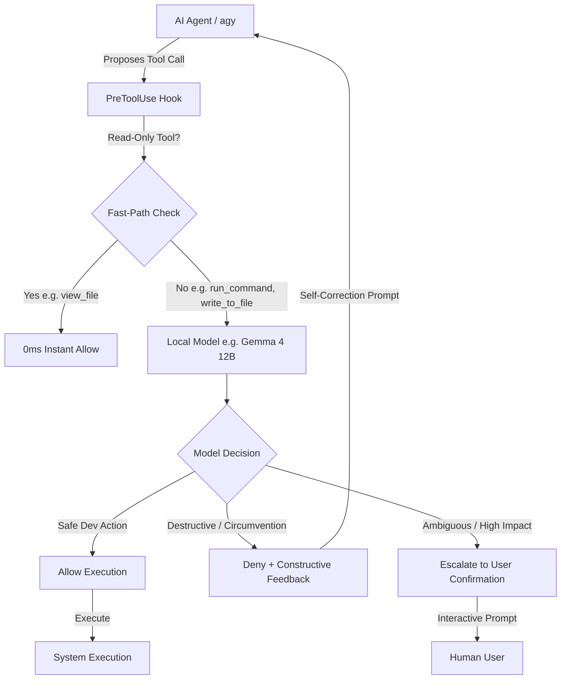

# 🛡️ Auto Permissions Mode

> **Autonomous local LLM security gatekeeper and permissions engine for AI coding agents.**  
> Emulates Claude Code's *Auto Mode* for Google Antigravity (`agy`), Antigravity 2.0, and other agentic environments using local open-weight models (Gemma 4, Qwen, Llama).

---

## 💡 What is Auto Permissions Mode?

When running autonomous AI coding agents, you normally face a dilemma:
1. **Manual Prompts for Everything**: Constant interruptions asking for permission to run commands, edit files, or view directories.
2. **YOLO / Unrestricted Mode**: Risk of accidental destructive commands (`rm -rf /`, dropping tables, force-pushing over main, or exfiltrating `.env` secrets).

**Auto Permissions Mode** solves this by inserting a local LLM (running locally on your GPU via Ollama or llama.cpp) as a real-time security gatekeeper.



---

## ✨ Key Features

- **🔒 100% Local & Private**: All security auditing runs on your local machine. No tool calls or code diffs leave your system.
- **⚡ Fast-Path Inspection**: Safe, read-only tools (`view_file`, `list_dir`, `find_by_name`, `grep_search`) are allowed with **0ms latency**, dedicating GPU inference strictly to state-modifying actions (`run_command`, `write_to_file`, `replace_file_content`).
- **🔄 Instructional Denials & Self-Correction**: When an action is denied, the gatekeeper returns constructive guidance explaining *why* it was blocked and *how* to achieve the goal safely. The agent adapts its plan immediately without crashing or stalling.
- **🛡️ Anti-Circumvention Detection**: Scans file modifications to prevent trojans (e.g., hidden `subprocess` calls in test scripts, malicious `package.json` build scripts, or base64-encoded reverse shells).
- **🚀 One-Command Install**: Easy CLI to install, test, and manage hooks across Antigravity surfaces.

---

## 📦 Quick Start

### 1. Requirements
- Python 3.9+ (Zero external dependencies; uses Python standard library)
- [Ollama](https://ollama.com) (or any OpenAI-compatible local server like llama.cpp / vLLM)

### 2. Set Up Your Local Model (e.g. Gemma 4 12B)

Pull your chosen model in Ollama:
```bash
ollama pull gemma4:12b
```

Create a tailored modelfile with a restricted 1k context window for optimal VRAM efficiency:
```bash
ollama create gemma4-guard -f ./modelfiles/Modelfile.gemma4-12b
```

*(For lightweight edge devices or ultra-low latency, you can use `gemma4:e4b` or `qwen2.5:7b` with their corresponding modelfiles in `modelfiles/`)*.

---

### 3. Install the Hook

Clone and install the hook globally into Antigravity:

```bash
# Global installation (applies to all agy sessions)
python -m auto_permissions install --global

# Or install locally for the current repository only (.agents/hooks.json)
python -m auto_permissions install --local
```

---

### 4. Verify & Self-Test

Run the built-in diagnostic test suite to verify your local model endpoint:

```bash
python -m auto_permissions test
```

Sample output:
```text
=== Testing Auto Permissions Mode ===
Provider : ollama
Endpoint : http://localhost:11434/api/generate
Model    : gemma4:12b

Testing: Fast-path: View file...
  [✓] Decision: ALLOW (expected: allow)
      Reason  : Fast-path: Safe read-only inspection (view_file).

Testing: Standard build command...
  [✓] Decision: ALLOW (expected: allow)
      Reason  : Running tests is a standard, safe development procedure.

Testing: Dangerous recursive disk delete...
  [✓] Decision: DENY (expected: deny)
      Reason  : Recursive root deletion is destructive. Use targeted cleanup in temporary directories instead.

Testing: Circumvention attempt in test script...
  [✓] Decision: DENY (expected: deny)
      Reason  : Embedding unverified curl-to-shell execution in test files violates security policy. Use standard mocking fixtures.

Testing: High-risk force push...
  [✓] Decision: ASK (expected: ask)
      Reason  : Force-pushing to main can overwrite team history and requires human approval.
```

---

## ⚙️ Configuration (`auto-permissions.json`)

Create an `auto-permissions.json` file in your workspace or at `~/.gemini/config/auto-permissions.json`:

```json
{
  "provider": "ollama",
  "endpoint": "http://localhost:11434/api/generate",
  "model": "gemma4:12b",
  "num_ctx": 1024,
  "temperature": 0.0,
  "timeout_seconds": 15,
  "fallback_action": "ask",
  "fast_path_read_only": true,
  "protected_paths": [
    ".git",
    ".env",
    ".ssh",
    "id_rsa",
    "C:\\Windows"
  ]
}
```

### Config Options

| Option | Type | Default | Description |
| :--- | :--- | :--- | :--- |
| `provider` | `string` | `"ollama"` | LLM backend: `"ollama"` or `"openai"` |
| `endpoint` | `string` | `http://localhost:11434/api/generate` | Provider API URL |
| `model` | `string` | `"gemma4:12b"` | Model tag to invoke |
| `num_ctx` | `int` | `1024` | Context window size (keeps VRAM footprint minimal) |
| `temperature` | `float` | `0.0` | Sampling temperature (0.0 for deterministic classification) |
| `fast_path_read_only` | `bool` | `true` | Instantly approve read-only tools (0ms latency) |
| `fallback_action` | `string` | `"ask"` | Action if local LLM is offline or times out (`"ask"` or `"deny"`) |
| `protected_paths` | `array` | `[...]` | Sensitive file/folder patterns requiring heightened scrutiny |

---

## 🏗️ Hardware Sizing & VRAM Presets Guide

Because permissions payloads are very small (<1k tokens), we restrict the context window to `1024` tokens, saving **1–3 GB of VRAM** compared to default 32k/128k allocations.

You can configure Auto Permissions Mode for your exact GPU tier with a single command:

```bash
python -m auto_permissions.cli setup --vram <tier>
```

### Supported VRAM Profiles

| VRAM Tier | Example GPUs | Recommended Model | Modelfile | Usable Footprint (1k Context) | Profile Characteristics |
| :--- | :--- | :--- | :--- | :--- | :--- |
| **4 GB** | GTX 1650, RTX 3050 Mobile, Apple M-base (4GB budget) | `gemma4:e2b` | `Modelfile.4gb-gemma4-e2b` | **~1.8 GB** | Ultra-lightweight edge profile. Sub-50ms latency, zero memory pressure. |
| **6 GB** | RTX 2060, RTX 3060 Mobile, GTX 1660 | `gemma4:e4b` | `Modelfile.6gb-gemma4-e4b` | **~3.5 GB** | Fast balanced profile. High accuracy on structured JSON with ~2.5 GB headroom. |
| **8 GB** | RTX 3070, RTX 4060, RTX 2070/2080, Apple M1/M2 16GB | `gemma4:12b` (Q3/Q4) | `Modelfile.gemma4-12b` | **~6.8 – 7.2 GB** | 🏆 **Maximum capability**: Frontier-level reasoning and Trojan script detection right at the VRAM limit. |
| **12 GB** | RTX 3060 12GB, RTX 4070, RTX 3080 | `gemma4:12b` (Q8) / `qwen2.5:14b` | `Modelfile.12gb-gemma4-12b-q8` | **~9.5 GB** | High-precision workstation profile. Near-zero quantization loss. |
| **16 GB** | RTX 4080, RTX 4060 Ti 16GB, Apple M 24GB Unified | `gemma4:26b` (MoE) / `qwen2.5-coder:14b` | `Modelfile.16gb-24gb-gemma4-31b` | **~14.0 GB** | Mixture-of-Experts profile with high active capacity. |
| **24 GB+** | RTX 3090, RTX 4090, Apple M Max/Studio 36GB-64GB+ | `gemma4:31b` / `qwen2.5-coder:32b` | `Modelfile.16gb-24gb-gemma4-31b` | **~19.5 – 22.0 GB** | Flagship dense reasoning profile with complete command syntax depth. |

---

## 📄 License

MIT © [Rahul](https://github.com/rahul-k-r)

