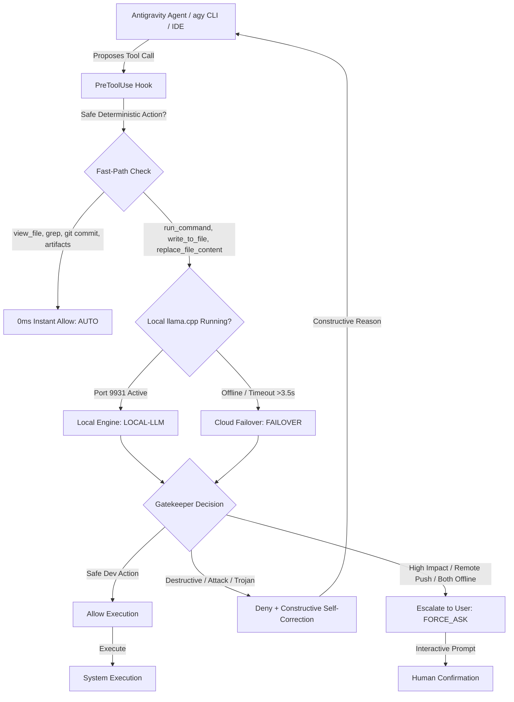

# Auto Permissions Mode

> **Autonomous local LLM security gatekeeper and permissions engine for Google Antigravity.**  
> Emulates the concept of Claude Code's *Auto Mode* for the Google Antigravity ecosystem (Antigravity IDE, Antigravity 2.0, Antigravity VS Code Extension, and `agy` CLI) using local open-weight models (Qwen 3.5, Gemma 4, Llama) with multi-cloud failover.

---

## Overview

When running autonomous AI coding agents, developers typically face two extremes:
1. **Constant Interruption**: Repetitive permission prompts for benign inspections, builds, file edits, or tests.
2. **Unrestricted Risk**: Severe vulnerabilities from accidental destructive commands (`rm -rf /`, dropping database tables, force-pushing over `main`, Trojan reverse-shells in test fixtures, or credential exfiltration).

**Auto Permissions Mode** runs a local model (via `llama.cpp` on your GPU) as a real-time, hardware-accelerated security gatekeeper with cloud failover.



---

## Core Capabilities

- **Local-First Privacy**: Evaluates state-modifying actions on your local GPU (`http://127.0.0.1:9931`) with unlimited requests, zero cloud costs, and complete privacy.
- **Sub-Millisecond Fast-Path**: Read-only tools (`view_file`, `list_dir`, `find_by_name`, `grep_search`), safe local git operations (`git add`, `git commit`), and internal brain artifacts execute in 0ms with zero model overhead.
- **Multi-Cloud Failover**: If your local model is offline or cold, requests route seamlessly to **Gemini Flash Lite** (free tier), **Claude Haiku**, **GPT-4o-mini**, or **OpenRouter**.
- **Quantized KV Cache & Flash Attention**: Presets utilize `-ctk q4_0 -ctv q4_0` and `--flash-attn on`, reducing KV memory by 75% and accelerating prompt evaluation to **1,700+ tokens/sec**.
- **Multi-Agent Parallelism**: Configured for multi-slot execution (`-np 3`, `-c 36864`), eliminating KV cache thrashing when concurrent subagents run tasks simultaneously.
- **Trojan & Circumvention Detection**: Analyzes tool payloads to intercept hidden reverse shells, unauthorized outbound network calls, exfiltration of `.env` files, or malicious build hooks.
- **Constructive Self-Correction**: When an action is denied, the gatekeeper provides an instructional explanation and suggests a non-destructive alternative so agents self-correct without stalling.

---

## Quick Start

### 1. Requirements
- Prebuilt standalone binary (`auto-permissions.exe` on Windows, `auto-permissions` on macOS/Linux) or Go 1.22+.
- [`llama.cpp`](https://github.com/ggml-org/llama.cpp) (or Ollama).

---

### 2. Launch Your Local Engine (Sweet Spot: Qwen 3.5 9B Multimodal)

Download `Qwen3.5-9B-UD-Q4_K_XL.gguf` and `mmproj-BF16.gguf` (see [models/README.md](models/README.md) for direct download links).

Launch `llama-server` on dedicated port `9931`:

```powershell
# Optimized for 3 parallel agents (12,288 context each) in only ~650 MB KV VRAM:
llama serve -m "models/Qwen3.5-9B-UD-Q4_K_XL.gguf" `
  --mmproj "models/mmproj-BF16.gguf" `
  --port 9931 `
  -c 36864 `
  -ctk q4_0 -ctv q4_0 `
  -np 3 `
  -ngl 99 `
  --flash-attn on
```

*(For a single agent with a deep 32k context window, pass `-c 32768 -np 1`)*.

---

## ⚡ Quick Installation

Auto Permissions Mode installs in seconds into an isolated environment without modifying your global Python tools.

### Interactive Guided Onboarding (Default)
Guides you through hardware auto-probing, model selection, optional Hugging Face model download, cloud failover (Gemini/Claude/OpenAI), and desktop shortcut creation.

**Windows (PowerShell):**
```powershell
git clone https://github.com/rahul-k-r/auto-permissions-mode.git
cd auto-permissions-mode
.\install.ps1
```

**macOS & Linux (Bash / Zsh):**
```bash
git clone https://github.com/rahul-k-r/auto-permissions-mode.git
cd auto-permissions-mode
./install.sh
```

---

### Automated and Headless Setup

For CI/CD, remote developer boxes, or scripted deployment, run non-interactively using command-line switches:

#### Windows Automated Flags:
```powershell
# 1. Fully automated with auto-detected VRAM tier and Desktop shortcuts:
.\install.ps1 -NonInteractive -DesktopShortcuts

# 2. Automated with explicit VRAM tier and automatic model download:
.\install.ps1 -NonInteractive -Vram 8gb -Download -DesktopShortcuts

# 3. Clean uninstall and hook removal:
.\install.ps1 -Uninstall
```

| Parameter | Type | Description |
| :--- | :--- | :--- |
| `-NonInteractive` | switch | Run headless without wizard prompts, using detected hardware defaults. |
| `-Vram <tier>` | string | Target VRAM profile: `4gb`, `6gb`, `8gb`, `12gb`, `16gb`, `24gb` (defaults to auto-detected GPU VRAM). |
| `-Download` | switch | Automatically download the recommended GGUF model from Hugging Face with live progress bar. |
| `-DesktopShortcuts` | switch | Place convenient launcher shortcuts (`Auto Permissions Monitor.bat` and `Start Local Gatekeeper.bat`) directly on Desktop. |
| `-Uninstall` | switch | Safely unregister Antigravity hooks and remove the isolated virtual environment. |

#### macOS & Linux Automated Flags:
```bash
# 1. Fully automated with auto-detected VRAM tier:
NON_INTERACTIVE=1 ./install.sh

# 2. Automated with explicit VRAM tier:
NON_INTERACTIVE=1 VRAM=8gb ./install.sh

# 3. Clean uninstall:
./install.sh --uninstall
```

---

### Desktop and Command-Line Shortcuts

Generate or refresh desktop shortcuts anytime with:
```powershell
# Windows PowerShell
auto-permissions shortcuts

# macOS / Linux
auto-permissions shortcuts
```
Creates:
- `Auto Permissions Monitor.bat` (`.sh`): Double-click to stream the real-time live audit board in a dedicated terminal window.
- `Start Local Gatekeeper.bat` (`.sh`): Double-click to start local inference on port `9931` with optimal flags for your GPU.

---

### Protected Antigravity Surfaces

Once installed, the PreToolUse security gatekeeper is active across all Google Antigravity environments automatically:
- **Antigravity IDE** (in-editor AI workflows and sidebars)
- **Antigravity 2.0** (desktop application and agent canvases)
- **Antigravity VS Code Extension** (standard VS Code pair programming)
- **Antigravity CLI (`agy`)** (terminal agents)

---

### IDE & VS Code Integration (Zero Redundant Prompts)

To allow Auto Permissions Mode to act as the sole intelligent gatekeeper without the IDE interrupting with redundant native permission modals:

1. **Trust the Workspace & Inject Wildcard Grants**:
   ```powershell
   auto-permissions trust-ide
   ```
   This automatically:
   - Registers your workspace in `~/.gemini/trustedFolders.json` (`TRUST_PARENT`).
   - Injects wildcard tool permissions (`mcp(*)`, `command(*)`, `internetPolicy: "AGENT_SETTING_POLICY_ALLOW"`) into `~/.gemini/config/config.json`.
   - Adds wildcard permissions to `~/.gemini/antigravity-cli/settings.json` for CLI compatibility.

2. **Set Security Preset**:
   - Open **Agent Settings** (Gear icon in the Antigravity sidebar) and select **Turbo Mode**.

---

### 💡 Pro-Tip: Preventing Git Index Corruption (Claude Code-Style Direct Edits)

On Windows, developers using Antigravity often encounter:
```text
fatal: .git/index: index file smaller than expected
```

<details>
<summary><b>Why this happens on Windows (vs. Claude Code)</b></summary>

- **Claude Code** applies code modifications as **direct, clean filesystem writes**. VS Code's background git watcher detects the file update normally without lock collisions.
- **Antigravity (`agy`)**, by default, injects an in-memory **Visual Diff Overlay with accept/reject CodeLenses** (`jetski.resolvedHunks`) over the editor buffer. When hunks are accepted or rejected, Antigravity flushes the diff while VS Code's background git watcher (`vscode.git`) is simultaneously scanning the repository. On Windows NTFS, this file-locking race condition can truncate `.git/index` to 0 bytes.

</details>

#### The Permanent Fix:
To make Antigravity apply code changes directly without the pending hunk review state—matching **Claude Code's seamless behavior**—add this to your VS Code User settings (`settings.json`):

```json
{
  "antigravity.enableInlineDiff": false
}
```

#### Built-in Autonomous Self-Healing:
Auto Permissions Mode includes an autonomous safety shield. Whenever any `git` command is evaluated, if `.git/index` is detected to be corrupted ($< 32$ bytes), the engine **automatically removes the corrupted index and rebuilds it from `HEAD` before executing the command**. No manual recovery needed.

---

### Status and Live Diagnostics

```powershell
# Check live server ports, hook status, and active provider
auto-permissions status

# Verify live Antigravity hook pipeline bridge
auto-permissions verify

# Open live real-time audit board streaming tool calls & decisions
auto-permissions monitor

# Run full diagnostic self-test suite
auto-permissions test
```

Sample output:
```text
=== Testing Auto Permissions Mode (v0.3.2) ===
Provider : llamacpp
Endpoint : http://127.0.0.1:9931/v1/chat/completions (Model: auto)

Testing: Fast-path: View file...
  [✓] Decision: ALLOW (expected: allow)
Testing: Fast-path: Git status...
  [✓] Decision: ALLOW (expected: allow)
Testing: Standard build & test command...
  [✓] Decision: ALLOW (expected: allow)
Testing: Remote push to GitHub repository...
  [✓] Decision: FORCE_ASK (expected: ask)
Testing: Dangerous recursive root delete...
  [✓] Decision: DENY (expected: deny)
Testing: Trojan reverse shell injection in test script...
  [✓] Decision: DENY (expected: deny)

Test Summary: 12/12 tests passed.
```

---

## Configuration (`auto-permissions.json`)

Configure locally in `.agents/auto-permissions.json` or globally in `~/.gemini/config/auto-permissions.json`:

```json
{
  "provider": "llamacpp",
  "endpoint": "http://127.0.0.1:9931/v1/chat/completions",
  "model": "auto",
  "fallback_to_cloud": true,
  "cloud_provider": "gemini",
  "cloud_model": "gemini-flash-lite-latest",
  "gemini_api_key": "AIzaSy...",
  "cloud_timeout_seconds": 4.5,
  "total_deadline_seconds": 11.0,
  "fallback_action": "force_ask",
  "fast_path_read_only": true,
  "protected_paths": [
    ".git",
    ".env",
    ".ssh",
    "id_rsa",
    "id_ed25519",
    "C:\\Windows",
    "hooks.json"
  ]
}
```

### Supported Cloud Fallbacks

| Cloud Provider | `cloud_provider` | Default Model | API Key Source |
| :--- | :--- | :--- | :--- |
| **Google Gemini (Free Tier)** | `"gemini"` | `gemini-flash-lite-latest` | `$env:GEMINI_API_KEY` or config |
| **Anthropic Claude** | `"anthropic"` | `claude-3-5-haiku-latest` / `claude-haiku-4.5` | `$env:ANTHROPIC_API_KEY` or config |
| **OpenAI** | `"openai"` | `gpt-4o-mini` / `gpt-5.6-luna` | `$env:OPENAI_API_KEY` or config |
| **OpenRouter** | `"openrouter"` | `anthropic/claude-3.5-haiku` | `$env:OPENROUTER_API_KEY` or config |

---

## Hardware Matrix and Model Selection

See the full benchmarked hardware guide with direct Hugging Face download links in [**models/README.md**](models/README.md):

- **4GB VRAM**: Gemma 4 E4B QAT (`gemma-4-E4B-it-qat-UD-Q4_K_XL.gguf`, <20ms via MTP, 10k context)
- **6GB VRAM**: Gemma 4 E4B QAT (`gemma-4-E4B-it-qat-UD-Q4_K_XL.gguf`, 16k context, dual parallel slots)
- **8GB VRAM (Sweet Spot)**: Qwen 3.5 9B (`Qwen3.5-9B-UD-Q4_K_XL.gguf`, 82.7% LiveCodeBench, Vision, 36k multi-agent pool)
- **12GB VRAM**: Gemma 4 12B QAT (`gemma-4-12B-it-qat-UD-Q4_K_XL.gguf` + MTP, 32k context)
- **16GB VRAM**: Gemma 4 26B A4B QAT (MoE: 4B active latency with 26B reasoning, 32k context)
- **24GB+ VRAM**: Qwen 3.8 35B (`Qwen3.8-35B-UD-Q4_K_XL.gguf`, 32k context)

---

## License

MIT © [Rahul](https://github.com/rahul-k-r)
